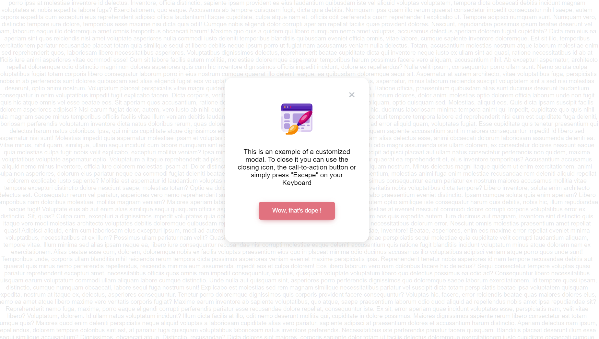

# ⚛️ leolegrandm-simple-dialog's example

leolegrandm-simple-dialog is a React, reusable component published on npm that anyone can use.
The goal of this project was to understand how component publishing on npm works and learn how to document components that can be used by anyone.

## Installation

```sh
npm install leolegrandm-simple-dialog
```

## Import & Usage

Import the Dialog component on your application like that
`import Dialog from 'leolegrandm-simple-dialog/dist/components/Dialog`

Call the Dialog component like that
`<Dialog/>`

> leolegrandm-simple-dialog is documented with JSdocs, use it freely in order to have more information on the methods of using the component, props and good practice
